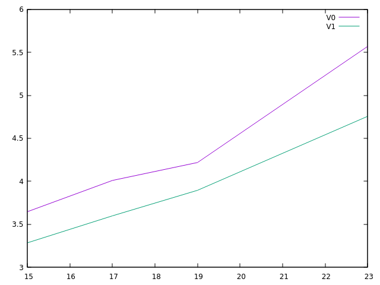
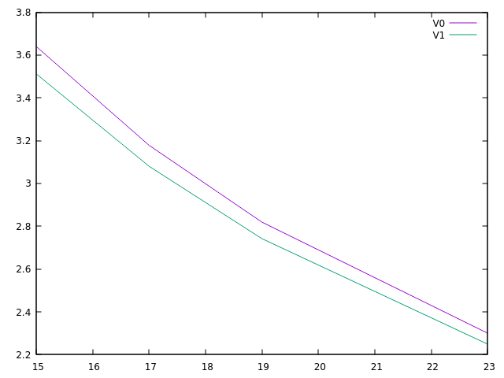
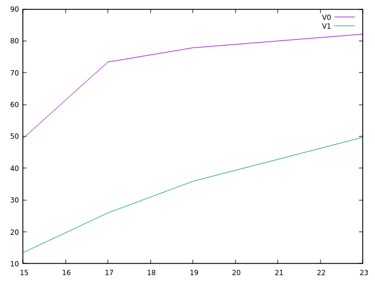
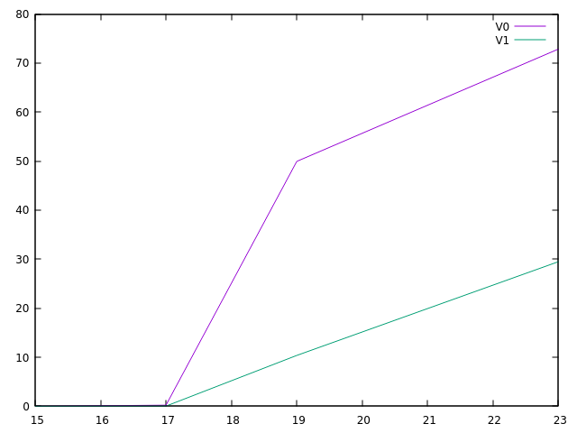
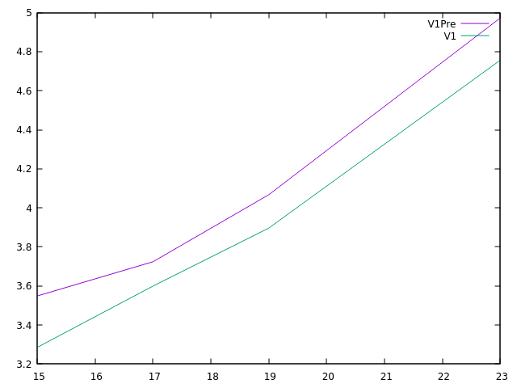
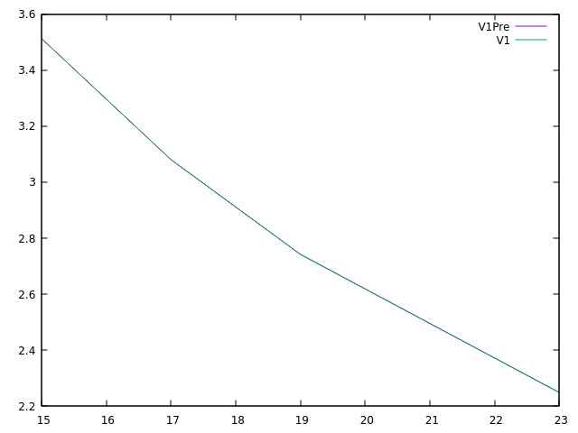
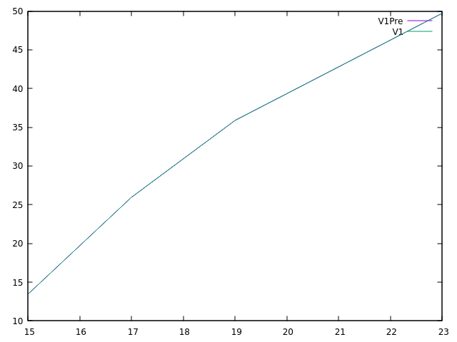
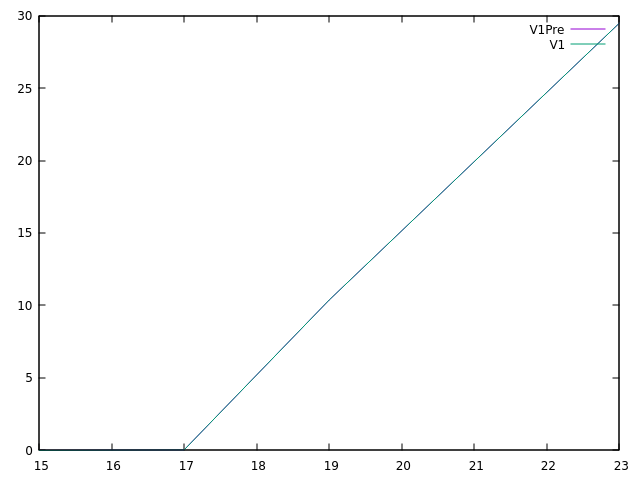

# Raport do zadania opt-binsearch23

### Autor: Wojciech Kieloch 
### Numer indeksu: 339952

Konfiguracja
---

Informacje o systemie:

 * Dystrybucja: Linux Mint 21.1 x86_64
 * Jądro systemu: 5.15.0-73-generic
 * Kompilator: gcc (Ubuntu 11.3.0-1ubuntu1~22.04.1) 11.3.0
 * Procesor: AMD Ryzen 7 5700U
 * Liczba rdzeni: 8 (16 wątków)

Pamięć podręczna:

 * L1d: 32 KiB, 8-drożny (per rdzeń), rozmiar linii 64B
 * L2: 512 KiB, 8-drożny (per rdzeń), rozmiar linii 64B
 * L3: 8192 KiB , 16-drożny (współdzielony), rozmiar linii 64B

Pamięć TLB:

 * L1d: 4KiB strony, Fully associative, 64 wpisy
 * L2d: 4KiB strony, 8-drożny, 2048 wpisów

Informacje o pamięciach podręcznych uzyskano na podstawie wydruku programu
`x86info`.

Wyniki eksperymentów
---

Legenda:
* V0 - niezoptymalizowany algorytm
* V1 - zoptymalizowany algorytm
* V1Pre - zoptymalizowany algorytm używający __builtin_prefetch

Do pomiarów użyto ziarna: 0x5bab3de5da7882fb

**Przykładowy wykres przedstawiający uśrednione pomiary prędkości:**

Oś X: Rozmiar: n

Oś Y: Czas w sekundach.



**Przykładowy wykres przedstawiający uśrednione pomiary branch missów:**

Oś X: Rozmiar: n

Oś Y: Procent missów.



**Przykładowy wykres przedstawiający uśrednione pomiary l1 missów:**

Oś X: Rozmiar: n

Oś Y: Procent missów.



**Przykładowy wykres przedstawiający uśrednione pomiary ll missów:**

Oś X: Rozmiar: n

Oś Y: Procent missów.



**(Prefetch) Przykładowy wykres przedstawiający uśrednione pomiary prędkości:**

Oś X: Rozmiar: n

Oś Y: Czas w sekundach.



**(Prefetch) Przykładowy wykres przedstawiający uśrednione pomiary branch missów:**

Oś X: Rozmiar: n

Oś Y: Procent missów.



**(Prefetch) Przykładowy wykres przedstawiający uśrednione pomiary l1 missów:**

Oś X: Rozmiar: n

Oś Y: Procent missów.



**(Prefetch) Przykładowy wykres przedstawiający uśrednione pomiary ll missów:**

Oś X: Rozmiar: n

Oś Y: Procent missów.



...

Wnioski
---

**I: Czemu zmiana organizacji danych spowodowała przyspieszenie algorytmu wyszukiwania?**

Ponieważ predyktor dostępów do pamięci przygotowuje pamięć, która znajduje się blisko aktualnie używanej.
Im głębiej leży element z drzewa, tym rzadziej będzie występowało o niego zapytanie. Oczywiście najczęściej będziemy się pytać o pamięć roota. Zatem ustawiamy poziomy drzewa liniowo w tablicy, przez co pytając się o element drzewa z poziomu k, predyktor ma możliwość przygotowania pamięci odnoszącej się do poziomu k+1, ponieważ leży blisko poziomu k. Przyśpiesza to proces poprzez skrócenie czasów dostepu.

**II: Jak zmieniła się lokalność czasowa elementów przechowywanych w pamięci podręcznej**

Nie zmienia się, zmienia się lokalność przestrzenna. Żądania pozostają takie same, więc lokalność czasowa również.

**III: Czy użycie instrukcji wbudowanych kompilatora «__builtin_expect» i «__builtin_prefetch» przynosi jakieś zyski?**

Użycie instrukcji __builtin_expect nie przynosi zysków, aplikując ją do "arr[i] == x" lub warunku pętlu (aplikowanie jej gdzie indziej nie ma sensu probabilistycznego). Skompilowany kod pod gcc 13.1 jest taki sam dla wersji z instrukcją jak i bez. __builtin_prefetch natomiast zmienia kod, ale nie przynosi zysków w żadnej kategorii, co widać na powyższych diagramach.

```
bool binsearch1(int *arr, long size, int x) {
  int i = 0;
  while(i < size)
  {
    __builtin_prefetch(&arr[i], 0, 3);
    if(arr[i] == x) return true;
    else if(x < arr[i]) i = 2*i+1;
    else i = 2*(i+1);
  }
  return false;
}
```

**IV: Jeśli ich użyjesz należy wytłumaczyć co robią**

__builtin_expect - funkcja używana do informowania kompilatora o przewidywaniach dot. skoków. Pierwszym argumentem jest wyrażenie, drugim zazwyczaj oczekiwana wartość. Kompilator wiedząc, która część kodu ma większą szansę wykonania, umieści kod maszynowy tak, aby fetchowanie instrukcji przez procesor było wygodniejsze.


__builtin_prefetch - funkcja używana do minimalizowania opóźnień cache'u miss'ów poprzez wrzucanie elementu do cache'a zanim nastąpi do niego odwołanie. Pierwszy argument wskazuje na element, drugi informuje o tym, czy będzie następował do niego zapis, czy tylko odczyt, a trzeci mówi o priorytecie lokalności czasowej.


Zoptymalizowana wersja jest szybsza, ma podobną ilość branch mis. (różnica 0.1%), znaczną mniejszą ilość l1 missów (średnia różnica ok. 40%), i mniejszą ilość ll missów (średnia różnica 40%).