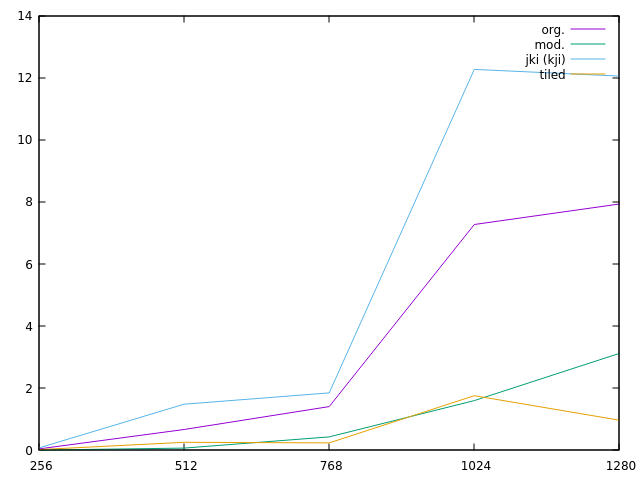
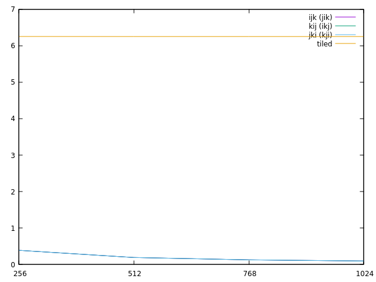
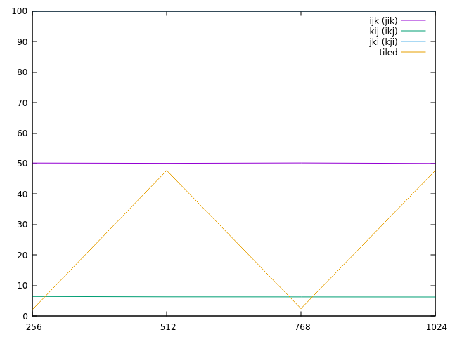
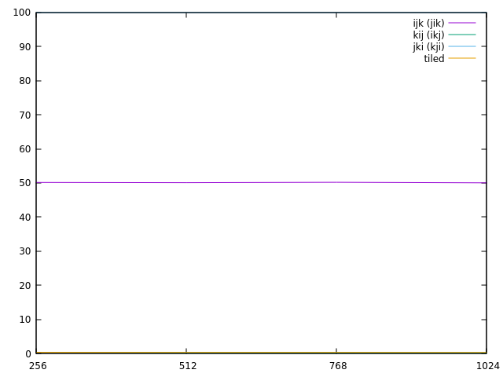
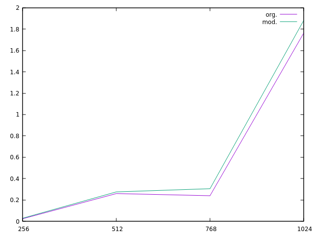

# Raport do zadania opt-matmult23

### Autor: Wojciech Kieloch 
### Numer indeksu: 339952

Konfiguracja
---

Informacje o systemie:

 * Dystrybucja: Linux Mint 21.1 x86_64
 * Jądro systemu: 5.15.0-73-generic
 * Kompilator: gcc (Ubuntu 11.3.0-1ubuntu1~22.04.1) 11.3.0
 * Procesor: AMD Ryzen 7 5700U
 * Liczba rdzeni: 8 (16 wątków)

Pamięć podręczna:

 * L1d: 32 KiB, 8-drożny (per rdzeń), rozmiar linii 64B
 * L2: 512 KiB, 8-drożny (per rdzeń), rozmiar linii 64B
 * L3: 8192 KiB , 16-drożny (współdzielony), rozmiar linii 64B

Pamięć TLB:

 * L1d: 4KiB strony, Fully associative, 64 wpisy
 * L2d: 4KiB strony, 8-drożny, 2048 wpisów

Informacje o pamięciach podręcznych uzyskano na podstawie wydruku programu
`x86info`.

Wyniki eksperymentów
---

**Przykładowy wykres przedstawiający uśrednione pomiary czasu działania dla różnych wartości n:**

Oś X: Rozmiar: n

Oś Y: Czas w sekundach.

**Przykładowy wykres przedstawiający uśrednione pomiary branch mis. dla różnych wartości n:**

Oś X: Rozmiar: n

Oś Y: Procent miss'ów.

(Wartości są takie same dla wszystkich algorytmów oprócz kafelkowego)

**Przykładowy wykres przedstawiający uśrednione pomiary L1 miss'ów dla różnych wartości n:**

Oś X: Rozmiar: n

Oś Y: Procent miss'ów.

(Algorytm "jki" stale utrzymuje 100%, trójkątna funkcja "tiled" występuje w przeciągu wielu prób)

**Przykładowy wykres przedstawiający uśrednione pomiary LL miss'ów dla różnych wartości n:**

Oś X: Rozmiar: n

Oś Y: Procent miss'ów.

(Algorytm "jki" stale utrzymuje 100%, "tiled" i "kij" mają podobne wartości)

**Przykładowy wykres przedstawiający uśrednione pomiary dla różnych offsetów (org. i 0)**

Oś X: Rozmiar: n

Oś Y: Czas w sekundach

Wnioski
---

**I: Czy uzyskane wyniki różnią się od tych uzyskanych na slajdzie?**

Uzyskane wyniki nie różnią się znacząco od tych uzyskanych na slajdzie, proporcje są zachowane.

**II: Z czego wynika rozbieżność między wynikami dla poszczególnych wersji mnożenia macierzy?**

Rozbieżność między wynikami wynika z różnicy pomiędzy dostępami do pamięci podręcznej w algorytmach. Najszybciej wykonują się te, które w każdej iteracji odwołują się do pamięci, która była blisko pamięci poprzedniej iteracji (predyktor pamięci procesora jest w stanie łatwo przewidzieć dostęp).
W dodatku algorytm kafelkowy dzieli liczenie macierzy na kafelki, takie, które mieszczą w się cachu L1, przez co dostęp do pojedynczych elementów jest szybszy (mniej cache'u missów), a algorytm działa wydajniej dla większych macierzy.

**III: Jaki wpływ ma rozmiar kafelka na wydajność «matmult3»? Czy rozmiar kafelka ma znaczenie?**

Rozmiar kafelka decyduje o tym, czy odwoływanie się do pamięci będzie wydajne.
Trzy kafelki powinny mieścić się w cachu, aby efektywnie obliczyć obszar macierzy. Jeżeli rozmiar jest za duży, będą następować missy cache'u, przez co program spowolni.

**IV: Dla jakich wartości n obserwujesz znaczny spadek wydajności?**

Wydajność zaczyna spadać razem ze wzrostem wartości n. Dla n = 2048 efektywny algorytm kafelkowy wymaga już ok. 7 s. Może też zauważyć, że dla n = 1024 algorytm v2 wymaga już znacznie więcej czasu (skok z ok. 1 s do 12 s).

**V: Czy inny wybór wartości domyślnych «*_OFFSET» daje poprawę wydajności?**

Inny wybór wartości nie daje poprawy wydajności. Algorytm z offsetem 0 jest o niewielką wartość mniej wydajny, co widać na diagramie.

**Reasumując:**

Wersja kafelkowa jest najlepsza. Działa najszybciej spośród pozostałych, co przedstawiono na diagramie.