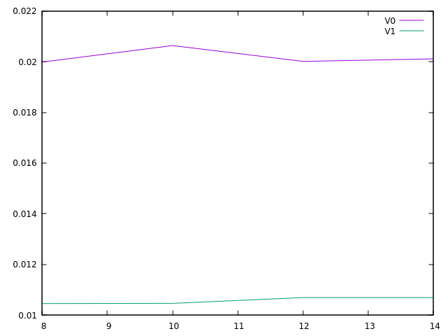
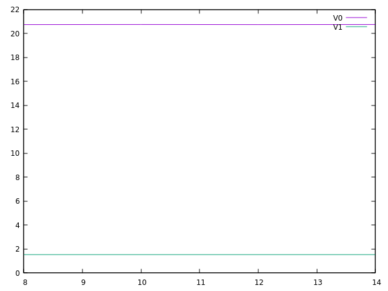
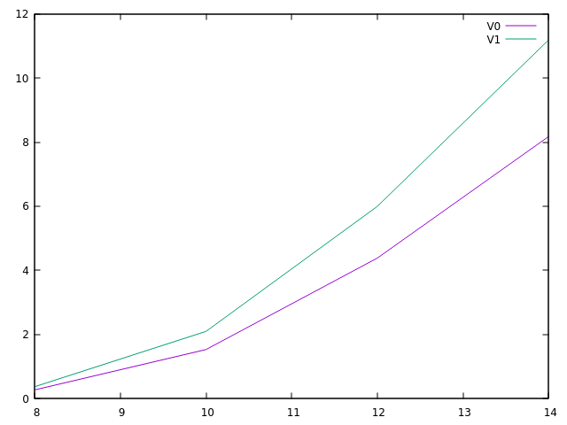
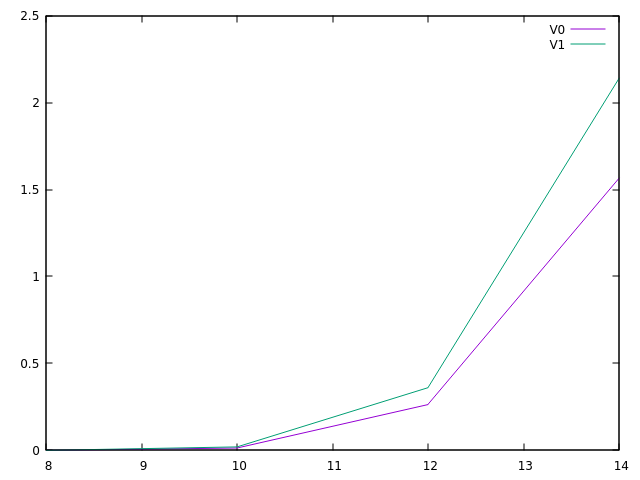

# Raport do zadania opt-randwalk23

### Autor: Wojciech Kieloch 
### Numer indeksu: 339952

Konfiguracja
---

Informacje o systemie:

 * Dystrybucja: Linux Mint 21.1 x86_64
 * Jądro systemu: 5.15.0-73-generic
 * Kompilator: gcc (Ubuntu 11.3.0-1ubuntu1~22.04.1) 11.3.0
 * Procesor: AMD Ryzen 7 5700U
 * Liczba rdzeni: 8 (16 wątków)

Pamięć podręczna:

 * L1d: 32 KiB, 8-drożny (per rdzeń), rozmiar linii 64B
 * L2: 512 KiB, 8-drożny (per rdzeń), rozmiar linii 64B
 * L3: 8192 KiB , 16-drożny (współdzielony), rozmiar linii 64B

Pamięć TLB:

 * L1d: 4KiB strony, Fully associative, 64 wpisy
 * L2d: 4KiB strony, 8-drożny, 2048 wpisów

Informacje o pamięciach podręcznych uzyskano na podstawie wydruku programu
`x86info`.

Wyniki eksperymentów
---

Legenda:
* V0 - algorytm niezoptymalizowany.
* V1 - algorytm zoptymalizowany.

Seed dla wszystkch testów jest taki sam (0xea3495cc76b34acc).

**Przykładowy wykres szybkości przedstawiający uśrednione pomiary dla różnych wartości n:**

Oś X: Rozmiar: n.

Oś Y: Czas w sekundach.

**Przykładowy wykres branch misprediction przedstawiający uśrednione pomiary dla różnych wartości n:**

Oś X: Rozmiar: n

Oś Y: Procent branch misprediction.

**Przykładowy wykres L1 cache miss'ów przedstawiający uśrednione pomiary dla różnych wartości n:**

Oś X: Rozmiar: n

Oś Y: Procent L1 cache miss'ów.

**Przykładowy wykres LL cache miss'ów przedstawiający uśrednione pomiary dla różnych wartości n:**

Oś X: Rozmiar: n

Oś Y: Procent LL cache miss'ów.

...

Wnioski
---

**I: Ile instrukcji maszynowych ma ciało pętli przed i po optymalizacji?**

Korzystając z gcc 13.1 x86-64 z flagą -O3, w wersji przed optymalizacją, pętla ma 50 instrukcji.
Wersja zoptymalizowana ma 49 instrukcji.

**II: Ile spośród nich to instrukcje warunkowe?**

Wersja niezoptymalizowana pętli ma 9 instrukcji skoku + 1 call + 4 instrukcje set.
Wersja zoptymalizowana ma 3 instrukcje skoku + 1 call + 8 instrukcji set.

**III: Czy rozmiar tablicy ma duży wpływ na działanie programu?**

Nie, różnica jest niezauważalna, co potwierdza wykres.

Wersja zoptymalizowana jest lepsza. Jest niemal dwa razy szybsza i nie zwalnia wraz ze wzrostem n. Ilość branch miss'ów jest ok. 11 razy mniejsza, ilość L1 missów jest mniejsza jak i również LL missów, co wynika z wykresów.
