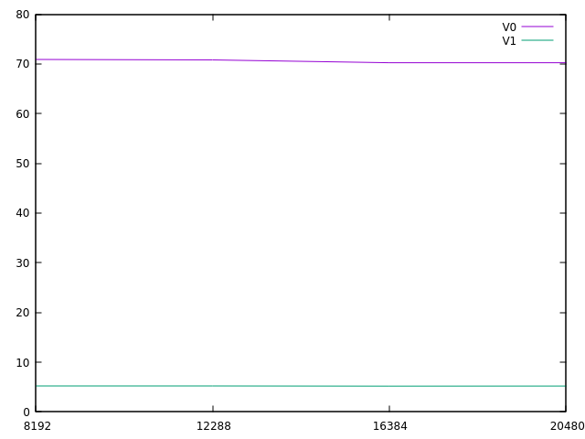

# Raport do zadania opt-texture23

### Autor: Wojciech Kieloch 
### Numer indeksu: 339952

Konfiguracja
---

Informacje o systemie:

 * Dystrybucja: Linux Mint 21.1 x86_64
 * Jądro systemu: 5.15.0-73-generic
 * Kompilator: gcc (Ubuntu 11.3.0-1ubuntu1~22.04.1) 11.3.0
 * Procesor: AMD Ryzen 7 5700U
 * Liczba rdzeni: 8 (16 wątków)

Pamięć podręczna:

 * L1d: 32 KiB, 8-drożny (per rdzeń), rozmiar linii 64B
 * L2: 512 KiB, 8-drożny (per rdzeń), rozmiar linii 64B
 * L3: 8192 KiB , 16-drożny (współdzielony), rozmiar linii 64B

Pamięć TLB:

 * L1d: 4KiB strony, Fully associative, 64 wpisy
 * L2d: 4KiB strony, 8-drożny, 2048 wpisów

Informacje o pamięciach podręcznych uzyskano na podstawie wydruku programu
`x86info`.

Wyniki eksperymentów
---

W rozwiązaniu użyto krzywej Mortona.

Legenda:
* V0 - niezoptymalizowany algorytm
* V1 - zoptymalizowany algorytm

Do pomiarów użyto ziarna: 0xdeadc0de

**Przykładowy wykres przedstawiający uśrednione pomiary czasu działania dla różnych wartości t:**

Oś X: Wartość t.

Oś Y: Czas w sekundach.

**Przykładowy wykres przedstawiający uśrednione pomiary L1 miss'ów dla różnych wartości t:**

Oś X: Wartość t.

Oś Y: Procent miss'ów.

**Przykładowy wykres przedstawiający uśrednione pomiary LL miss'ów dla różnych wartości t:**

Oś X: Wartość t.

Oś Y: Procent miss'ów.

**Diagram branch mis. został pominięty, jako że wartość ta jest niezależna od algorytmów (ponieważ oba są bezwarunkowe). Wartość utrzymuje się na poziomie ok. 2.49%.**

...

Wnioski
---

W rozwiązaniu użyto krzywej Mortona.

**I & II: Czemu zmiana organizacji danych spowodowała przyspieszenie? Czy translacja adresów ma zauważalny wpływ na wydajność przeglądania tekstury?**

Zmiana organizacji danych nie spowodowała przyśpieszenia. Najwyraźniej w tym przypadku obliczanie wartości niweluje przewagę uzyskaną poprzez zmniejszenie ilości missów. Natomiast w przypadku uśrednionym taka optymalizacja powinna spowodować przyspieszenie poprzez poprawę lokalności pamięci podręcznej, jako że zmniejsza ona dystans w pamięci między komórkami, które reprezentują piksele leżące blisko siebie w teksturze, co daje możliwość wcześniejszego załadowania pamięci.

Co więcej, zaimplementowana krzywa Mortona wcale nie oblicza się szybciej w metodzie używającej głównie operatorów bitowych. Lepsze wyniki uzyskuje metoda z tabelami.

W przypadku uśrednionym [metoda Mortona powinna mieć zauważalny wpływ na wydajność przeglądania tekstury](https://www.nocentino.com/Nocentino10.pdf).

**III: Jaki jest optymalny rozmiar kafla?**

W idealnej sytuacji, bez innych procesów, rozmiar kafla powinien wynosić około rozmiar cache L1.

**IV: Czy zoptymalizowana wersja wykonuje więcej instrukcji na jeden element?**

Kompilator gcc 13.1 x86-64 z flagą -O3 zwraca 12 instrukcji dla wersji zoptymalizowanej.
Dla wersji oryginalnej z tymi samymi ustawieniami - 3 instrukcje.
Zoptymalizowana wersja wykonuje więcej instrukcji na jeden element.

Metoda krzywej Mortona w uśrednionym przypadku jest lepsza. Jednak w moim uzyskuje ona gorszy czas wykonania. Natomiast w kategorii L1 i LL miss'ów uzyskuje ona wyniki średnio 14 razy lepsze od metody oryginalnej (ok. 70% vs 5%).